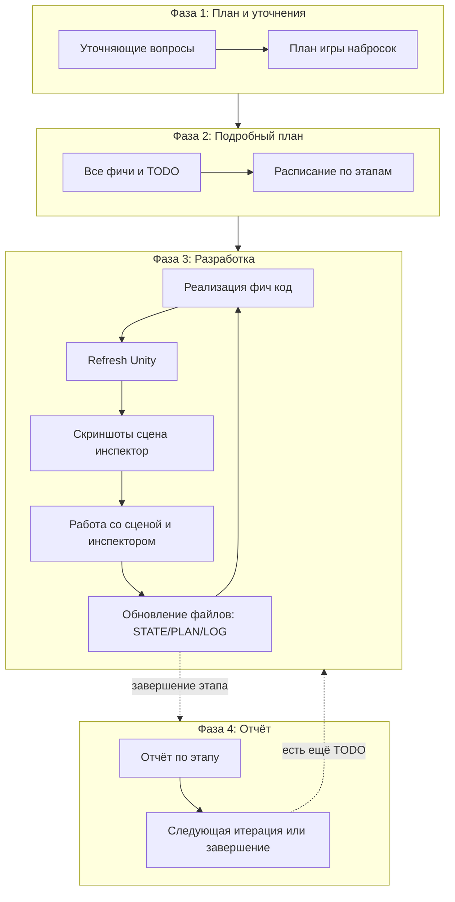
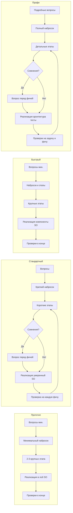

# Подробное описание режимов разработки

Документ для детального просмотра перед выбором режима: отличия, описание каждого режима и схема воркфлоу.

---

## Отличия режимов

| Режим           | Цель                         | Объём наброска      | Этапы              | Вопросы | Проверки              | QA человеком | Файлы состояния | Стиль кода     |
|-----------------|------------------------------|----------------------|--------------------|---------|----------------------|--------------|-----------------|----------------|
| **Прототип**    | Проверить идею быстро        | Минимум (1 экран)    | 2–3 крупных блока  | Перед планом (мин.) | Только в конце       | Финальная    | По желанию      | Хардкод, SO    |
| **Стандартный** | Маленькая цельная игра       | Краткий (2–3 экрана) | Короткие с чеклистом | Перед планом + фичей | На каждую фичу      | На фичу (опц.) + Финальная | STATE+PLAN+LOG | Умеренный, SO  |
| **Быстрый**     | Быстро до играбельного билда | Набросок + этапы     | Крупные            | Перед планом (мин.) | Только в конце       | Финальная    | STATE+PLAN кратко | Компоненты, SO |
| **Профи**       | Долгий проект с заделом      | Полный (системы, данные) | Детальные с критериями | Перед планом + фичей | На задачу и фичу | На фичу (опц.) + Финальная | Полный STATE+PLAN+LOG | Архитектура, тесты |

**Общее для всех:** настройки и данные — только в ScriptableObject (NpcData, GameFightData, UiData и т.д.).

### Когда какой режим выбирать

| Ситуация | Рекомендуемый режим |
|----------|---------------------|
| «Хочу проверить одну идею за час-два» | **Прототип** |
| «Маленькая игра на 1–3 дня, аккуратно» | **Стандартный** |
| «Нужен играбельный билд побыстрее, без лишних отчётов» | **Быстрый** |
| «Серьёзный проект на недели/месяцы, нужна архитектура» | **Профи** |
| «Не уверен» | **Стандартный** (баланс скорости и качества) |

### Чем Стандартный отличается от Быстрый

- **Стандартный** — маленькая по объёму игра (мало механик, мало экранов). Процесс полный: этапы с чеклистом, проверка **на каждую фичу**, файлы состояния обязательны.
- **Быстрый** — упор на скорость: меньше отчётов и скриншотов, этапы крупнее, **проверки только в конце**. Объём игры может быть любым.

---

## Описание режимов

### Прототип

**Для кого:** проверить идею за пару часов, получить playable за минимум времени.

- **Уточняющие вопросы:** перед планом — минимум (1–3). По ходу — нет.
- Набросок минимальный (1 экран, 1–2 механики).
- 2–3 крупных этапа без детальных чеклистов.
- Код — хардкод, настройки обязательно в SO.
- Проверки в редакторе и скриншоты — **только в самом конце** после всех блоков.
- **Финальная QA:** обязательно в конце (шаги + ожидаемое поведение).
- Файлы состояния (DEV_STATE/PLAN/LOG) по желанию или кратко.

Подробнее: [modes/prototype.md](modes/prototype.md)

### Стандартный

**Для кого:** небольшая цельная игра (мало механик, мало экранов) с нормальным процессом.

- **Уточняющие вопросы:** перед планом — да. **Перед каждой фичей — если есть сомнения.**
- Краткий набросок (жанр, 2–3 механики, 2–3 экрана).
- Короткие этапы с чеклистом по этапу.
- Стиль кода — умеренный, все данные в SO.
- **На каждую фичу** — проверка в редакторе, скриншот/чеклист, затем следующая фича.
- **QA на фичу (опционально):** если включена — агент пишет QA-шаги, пользователь проверяет.
- **Финальная QA:** обязательно в конце.
- Файлы состояния (DEV_STATE + DEV_PLAN + Docs/DEV_LOG/) обязательны.

Подробнее: [modes/standard.md](modes/standard.md)

### Быстрый

**Для кого:** быстрее дойти до играбельного билда; меньше документирования.

- **Уточняющие вопросы:** перед планом — минимум (1–3). По ходу — нет.
- Набросок + список этапов; детализация меньше.
- Крупные этапы; можно делать **несколько фич за один проход**.
- Стиль кода — компоненты, данные в SO.
- Проверки — **только в самом конце** (после набора фич/этапа).
- **Финальная QA:** обязательно в конце.
- Файлы состояния кратко (DEV_STATE + DEV_PLAN), без избыточной истории.

Подробнее: [modes/fast.md](modes/fast.md)

### Профи (долгострой)

**Для кого:** масштабируемый проект, долгая разработка, тесты, полный учёт.

- **Уточняющие вопросы:** перед планом — подробные. **Перед каждой фичей — если есть сомнения.** По ходу — при неясностях.
- Полный набросок (системы, экраны, данные, расширяемость).
- Детальные этапы с чеклистами и критериями приёмки.
- Архитектура, SO, рефакторинг; **автотесты по умолчанию включены** (можно отключить по желанию).
- **Почти на каждую задачу в фиче** — проверка; плюс проверка **на фичу целиком**.
- **QA на фичу (опционально):** если включена — агент пишет QA-шаги + граничные случаи, пользователь проверяет.
- **Финальная QA:** обязательно в конце (полный чеклист, включая производительность).
- Полный формат: DEV_STATE (текущее + контекст), DEV_PLAN (план с чекбоксами), Docs/DEV_LOG/ (итерации со скриншотами).

Подробнее: [modes/pro.md](modes/pro.md)

---

## Схема воркфлоу (общая для всех режимов)

Общая последовательность фаз; детализация и момент проверок зависят от режима.

- **Прототип и Быстрый:** проверки (редактор, скриншоты) — только при переходе в Фазу 4 после всех фич/этапа. Уточняющие вопросы — только перед Фазой 1 (минимум).
- **Стандартный:** проверка после каждой фичи внутри Фазы 3. Уточняющие вопросы — перед Фазой 1 и **перед фичей если есть сомнения**.
- **Профи:** проверка после задач внутри фичи и после фичи; плюс автотесты. Уточняющие вопросы — подробные перед Фазой 1 и **перед фичей если есть сомнения**.

> **Уточняющие вопросы можно отключить/включить** по просьбе пользователя в любой момент.

---

## Схема воркфлоу по режимам

Краткая цепочка шагов в каждом режиме.

---

После просмотра вернитесь к [MODE_CHOICE.md](MODE_CHOICE.md) и напишите выбранный режим: **Прототип**, **Стандартный**, **Быстрый** или **Профи**.
