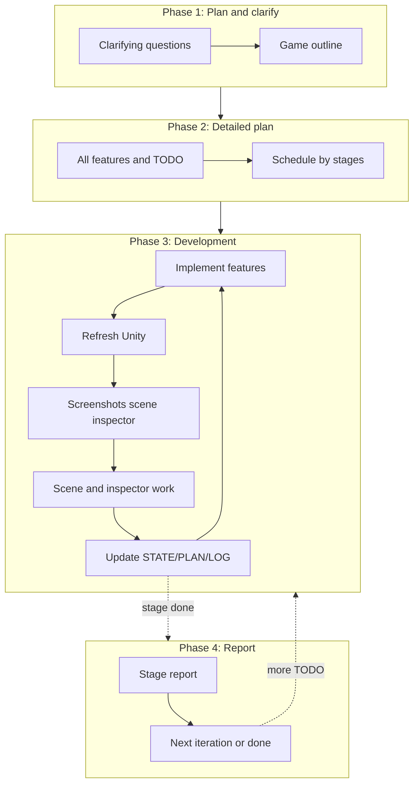
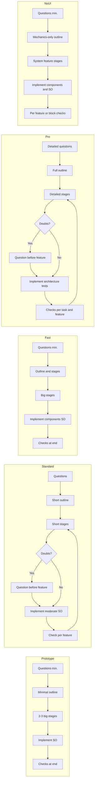

# Dev mode details

Document for choosing a mode: differences, per-mode description, and workflow.

---

## Mode comparison

| Mode | Goal | Outline size | Stages | Questions | Checks | QA (human) | State files | Code style |
|------|------|--------------|--------|-----------|--------|------------|-------------|------------|
| **Prototype** | Validate idea quickly | Min (1 screen) | 2–3 big blocks | Before plan (min.) | End only | Final | Optional | Hardcode, SO |
| **Standard** | Small complete game | Short (2–3 screens) | Short with checklist | Before plan + feature | Per feature | Per feature (opt.) + Final | STATE+PLAN+LOG | Moderate, SO |
| **Fast** | Quick to playable build | Outline + stages | Big | Before plan (min.) | End only | Final | STATE+PLAN brief | Components, SO |
| **Pro** | Long project with foundation | Full (systems, data) | Detailed with criteria | Before plan + feature | Per task and feature | Per feature (opt.) + Final | Full STATE+PLAN+LOG | Architecture, tests |
| **NoUI** | Gameplay/system tasks without UI pipeline | Mechanics-only outline | Feature-oriented | Before plan (min.) | Per feature/block | Final | STATE+PLAN+LOG | Components/SO, no UI stack |

**Common:** all settings and data in ScriptableObject (NpcData, GameFightData, UiData, etc.).

### When to choose which mode

| Situation | Recommended mode |
|-----------|-------------------|
| “Validate one idea in 1–2 hours” | **Prototype** |
| “Small game in 1–3 days, tidy” | **Standard** |
| “Playable build quickly, fewer reports” | **Fast** |
| “Serious project for weeks/months, need architecture” | **Pro** |
| “Нужна механика/системы без UI” | **NoUI** |
| “Not sure” | **Standard** (balance speed/quality) |

### Standard vs Fast

- **Standard** — small game (few mechanics, few screens). Full process: stages with checklist, check **per feature**, state files required.
- **Fast** — focus on speed: fewer reports/screenshots, bigger stages, **checks only at end**. Game size can be any.

---

## Mode descriptions

### Prototype

**For:** validate an idea in a couple of hours, get playable with minimal time.

- **Questions:** before plan — minimum (1–3). During — no.
- Minimal outline (1 screen, 1–2 mechanics).
- 2–3 big stages, no detailed checklists.
- Code — hardcode, settings in SO.
- Editor checks and screenshots — **only at the very end** after all blocks.
- **Final QA:** required at end (steps + expected behavior).
- State files (DEV_STATE/PLAN/LOG) optional or brief.

Details: [modes/prototype.md](modes/prototype.md)

### Standard

**For:** small complete game (few mechanics, few screens) with normal process.

- **Questions:** before plan — yes. **Before each feature — if in doubt.**
- Short outline (genre, 2–3 mechanics, 2–3 screens).
- Short stages with per-stage checklist.
- Code — moderate, all data in SO.
- **Per feature** — editor check, screenshot/checklist, then next feature.
- **QA per feature (optional):** if on — agent writes QA steps, user checks.
- **Final QA:** required at end.
- State files (DEV_STATE + DEV_PLAN + Docs/DEV_LOG/) required.

Details: [modes/standard.md](modes/standard.md)

### Fast

**For:** get to playable build faster; less documentation.

- **Questions:** before plan — minimum (1–3). During — no.
- Outline + stage list; less detail.
- Big stages; can do **several features in one pass**.
- Code — components, data in SO.
- Checks — **only at the end** (after a set of features/stage).
- **Final QA:** required at end.
- State files brief (DEV_STATE + DEV_PLAN), no heavy history.

Details: [modes/fast.md](modes/fast.md)

### Pro (long-term)

**For:** scalable project, long development, tests, full accounting.

- **Questions:** before plan — detailed. **Before each feature — if in doubt.** During — when unclear.
- Full outline (systems, screens, data, extensibility).
- Detailed stages with checklists and acceptance criteria.
- Architecture, SO, refactor; **autotests on by default** (can disable).
- **Per task in feature** — check; plus **per feature** check.
- **QA per feature (optional):** if on — agent writes QA steps + edge cases, user checks.
- **Final QA:** required at end (full checklist, including performance).
- Full format: DEV_STATE, DEV_PLAN, Docs/DEV_LOG/ (iterations with screenshots).

Details: [modes/pro.md](modes/pro.md)

### NoUI

**For:** feature/system development where UI is explicitly out of scope.

- **Questions:** minimal before plan (goal + done criteria), no UI intake.
- Outline excludes UI screens/layout and UI asset pipeline.
- Stages focus on mechanics, data, scene/system integration, checks.
- UI Builder/uGUI steps are skipped by default.
- If user later asks UI, switch mode or enable separate UI task.
- State files required (`DEV_STATE`, `DEV_PLAN`, `DEV_LOG`) as in Standard/Fast depending on scope.

Details: [modes/no_ui.md](modes/no_ui.md)

---

## Workflow (all modes)

Phases; when checks happen depends on mode.

- **Prototype and Fast:** checks (editor, screenshots) — only when moving to Phase 4 after all features/stage. Questions — only before Phase 1 (min.).
- **Standard:** check after each feature inside Phase 3. Questions — before Phase 1 and **before feature if in doubt**.
- **Pro:** check after tasks in feature and after feature; plus autotests. Questions — detailed before Phase 1 and **before feature if in doubt**.

> **Clarifying questions can be turned off/on** at user request.

---

## Per-mode workflow

Short step chain per mode.

---

Return to [MODE_CHOICE.md](MODE_CHOICE.md) and reply with the chosen mode: **Prototype**, **Standard**, **Fast**, **Pro**, or **NoUI**.
