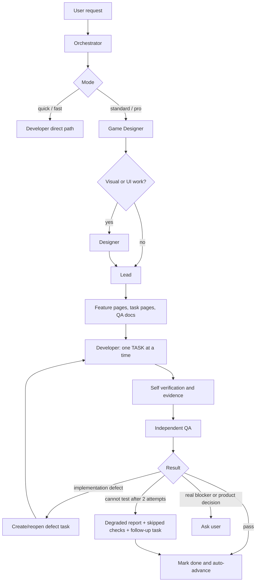

# Unity Game Agent


Autonomous Unity game development skill for Claude Code, Codex, Cursor, and other AI coding agents: from an idea or existing project task to implemented, documented, and verified Unity work.

This is not just a prompt pack. It is a role-based production pipeline with planning docs, task ownership, Unity preflight, reuse discovery, Play Mode QA, screenshots, tests, defect loops, and bounded failure recovery.

```text
INTAKE -> DESIGN -> PLAN -> BUILD -> VERIFY -> QA -> SHIP
```

## Why It Exists

Most Unity agents can write scripts. That is not the hard part.

The hard part is staying aligned with an existing project, not rewriting working systems, testing gameplay instead of claiming it works, tracking state across sessions, and moving forward when tools fail.

Unity Game Agent is built for that gap.

## What Makes It Different

| Capability | Generic coding agent | Basic Unity skill | Unity Game Agent |
|---|---:|---:|---:|
| Reads existing architecture before changing it | Sometimes | Sometimes | Required |
| Reuse-first search before custom code | Rare | Partial | Required |
| Explicit game design pass | No | No | Game Designer role |
| UI/UX and visual design pass | No | Partial | Designer role |
| Lead creates feature/task/QA docs | No | Rare | Required in standard/pro |
| One task per developer pass | No | Rare | Required |
| Independent QA pass | No | Partial | QA role + QA_AGENT checklist |
| Play Mode verification policy | Weak | Partial | Required by mode |
| EditMode/PlayMode test expectations | Optional | Optional | Declared per task/feature |
| Screenshot evidence and visual review | Optional | Partial | Required for visual/runtime-visible work |
| Interactive checks cannot pass from screenshots alone | Rare | Rare | Required |
| Failure recovery without infinite retry loops | Rare | Rare | 2 attempts -> degraded report -> continue |
| Persistent project state | Manual | Partial | Docs/DEV_STATE, DEV_LOG, DEV_PLAN |
| Skill self-improvement memory | No | No | SKILL_MEMORY.md |

## Pipeline



## Role System

The orchestrator stays accountable, but work is split into small role files so the agent does not keep every responsibility in one context.

| Role | Goal | Main output |
|---|---|---|
| Game Designer | Turn idea or vague gameplay into implementable design | `Docs/GAME_DESIGN.md` |
| Designer | Define UI/UX, visual direction, states, assets, and visual QA | `Docs/UI_BRIEF.md` |
| Lead | Convert design into feature pages, task pages, QA plans, risks | `Docs/DEV_PLAN.md`, `Docs/Features/`, `Docs/Tasks/`, `Docs/QA/`, `Docs/QA_AGENT/` |
| Developer | Implement exactly one task page with the smallest safe change | Code/assets/scenes plus task evidence |
| QA | Verify independently, create defects, avoid deadlocks | Filled `Docs/QA_AGENT/`, defect tasks, degraded reports |

In `standard` and `pro`, real subagents are mandatory when the tool environment supports them. If subagents are unavailable, the orchestrator records degraded mode and follows the same role files locally.

## Development Patterns

The pipeline is the engine; a **development pattern** is a swappable playbook for one *family* of games.
A pattern fills the same pipeline with concrete stack choices, scene skeletons, reuse maps, golden rules,
and anti-patterns — and is auto-selected by detecting the project (packages, namespaces, scene shape) or
matching the request for a new project.

| Pattern | Use for | Stack |
|---|---|---|
| `casual-neoxider` | Casual / hyper-casual / mobile: match-3, merge, lotto/bingo, slots, dress-up, idle/clicker, arcade, puzzle | NeoxiderTools (`Neo.*`) + NeoxiderPages + DOTween via Unity MCP |

Patterns are additive — drop a new `patterns/<name>/pattern.md` and register it. See
[patterns/README.md](patterns/README.md).

## Current Progress

These are implemented in the skill today.

| Area | Status | Evidence |
|---|---:|---|
| Runtime policy profile | Done | `templates/DEV_PROFILE.json` |
| Fast / standard / pro mode matrix | Done | `POLICY_MATRIX.md`, `modes/` |
| Reuse-first discovery policy | Done | `SKILL.md`, `tools/libraries-setup.md` |
| Role subskills | Done | `roles/game-designer.md`, `roles/designer.md`, `roles/lead.md`, `roles/developer.md`, `roles/qa.md` |
| Standard/pro feature docs | Done | `templates/FEATURE.md`, `templates/TASK.md` |
| Agent QA and independent QA docs | Done | `templates/QA_CHECKLIST.md`, `templates/QA_AGENT_CHECKLIST.md` |
| Play Mode QA automation policy | Done | `tools/playmode-qa-automation.md` |
| EditMode/PlayMode test expectations | Done | Feature/task verification fields |
| Screenshot evidence policy | Done | QA templates and Play Mode QA reference |
| Two-attempt QA failure recovery | Done | `qa_max_attempts_before_degraded_report: 2` |
| Skill memory | Done | `SKILL_MEMORY.md`, `tools/append-skill-memory.ps1` |
| Project bootstrap | Done | `setup_project.bat` |
| Feature doc generator | Done | `tools/new-feature-docs.ps1` |
| Skill validation | Done | `tools/validate-skill.ps1` |
| Script smoke tests | Done | `tools/test-scripts.ps1` |

## Verification Philosophy

The skill treats "it compiles" as a start, not a finish.

For Unity work, the close gate can include:

- compile/import readiness;
- console baseline and current console comparison;
- Play Mode run;
- console checks during Play Mode;
- declared runtime driver;
- EditMode tests;
- PlayMode tests;
- screenshot capture and visual review;
- task evidence in docs;
- independent QA result.

Interactive gameplay, UI flows, input, collision, spawning, scene transitions, pause, restart, and runtime state changes cannot pass from screenshots alone. They need a driver, test, scenario runner, input injection, or an explicit degraded report.

## Bounded QA Recovery

QA should be strict, but it should not freeze the whole project.

Rule:

```text
2 serious attempts per required QA check.
If still blocked: write degraded report, create follow-up task, continue.
```

The degraded report must include:

- what was attempted;
- exact failure reason;
- skipped checks;
- available evidence;
- player/user risk;
- follow-up defect or automation-gap task.

This keeps automation honest without turning one flaky tool path into a dead stop.

## Modes

| Mode | Use for | Cadence |
|---|---|---|
| fast | Prototype, small playable slice, quick validation | Larger feature batches, lighter docs |
| standard | Small complete game or meaningful feature work | Feature/task docs, Play Mode per feature, QA docs |
| pro | Larger systems, maintainability, tests, architecture | Task-level checks, stricter docs, relevant tests |

## Project Docs Created By The Pipeline

```text
Docs/
  DEV_CONFIG.md
  DEV_PROFILE.json
  GAME_DESIGN.md
  UI_BRIEF.md
  DEV_STATE.md
  DEV_PLAN.md
  AGENT_MEMORY.md
  ARCHITECTURE.md
  DEV_LOG/
  Screenshots/
  Features/
  Tasks/
  QA/
  QA_AGENT/
```

The docs are not ceremony. They are the agent's working memory, task ownership system, QA evidence trail, and resume point.

## Quick Start

1. Put this folder in your agent's skills location (e.g. `~/.claude/skills/unity-game-agent`, `~/.codex/skills/unity-game-agent`, or `.cursor/skills/unity-game`).
2. Open a Unity project or create an empty project.
3. Ask for a quick fix, a direct feature, or a full game.
4. The skill chooses the shortest verified path:
   - quick fix for narrow edits;
   - fast for prototypes;
   - standard for complete small games/features;
   - pro for stricter architecture and tests.

Optional bootstrap for tracked projects:

```powershell
.\setup_project.bat "<UnityProjectRoot>"
```

## MCP And Unity Automation

The skill is provider-neutral, with a CoplayDev Unity MCP adapter reference.

It expects the agent to prefer MCP/Editor automation when available:

- inspect editor state;
- wait for compile/import/domain reload;
- read console;
- run tests;
- enter Play Mode;
- capture screenshots;
- save scenes;
- run builds when relevant.

If MCP is unavailable, the skill falls back to CLI/file-level work only where safe, records degraded verification, and avoids pretending runtime behavior was tested.

## Honest Limits

This skill does not make Unity verification magically perfect. Some projects still need custom QA hooks, deterministic seeds, test scenes, or input drivers.

The difference is that the skill forces those gaps to become visible tasks instead of hidden assumptions.

## Best Fit

Use Unity Game Agent when you want:

- a real Unity project workflow, not one-shot script generation;
- autonomous progress with documented state;
- feature-by-feature delivery;
- QA evidence;
- reusable libraries and references before custom code;
- a system that can resume work across sessions.

For a one-line script edit, use quick mode. For a game or feature that should survive more than one session, use standard or pro.
